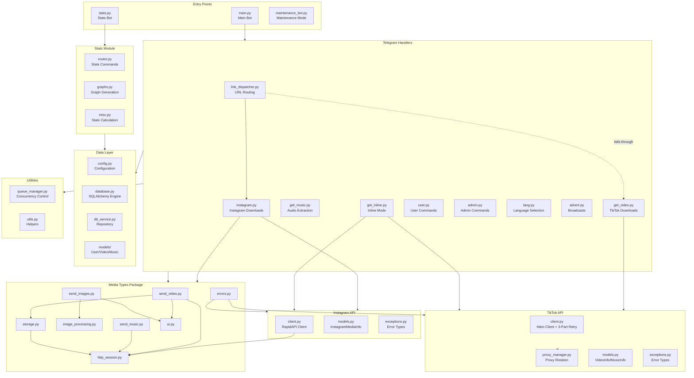
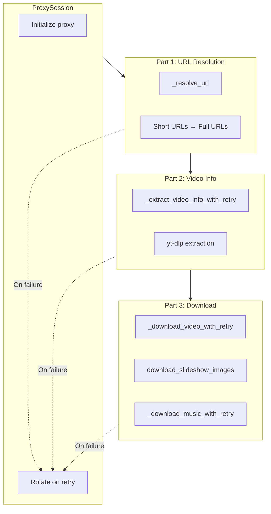
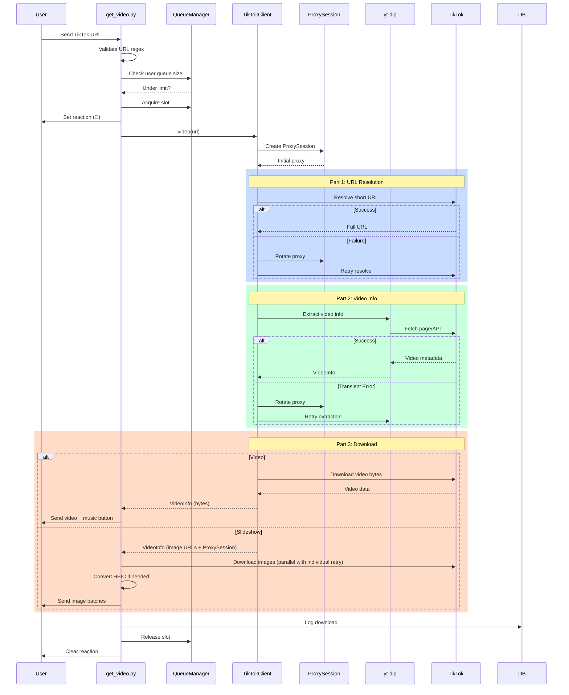
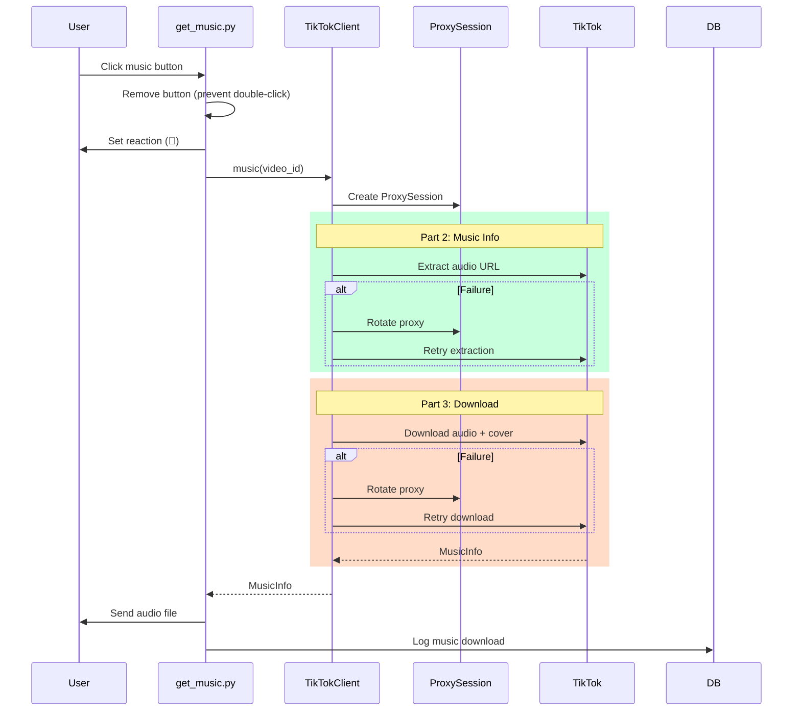
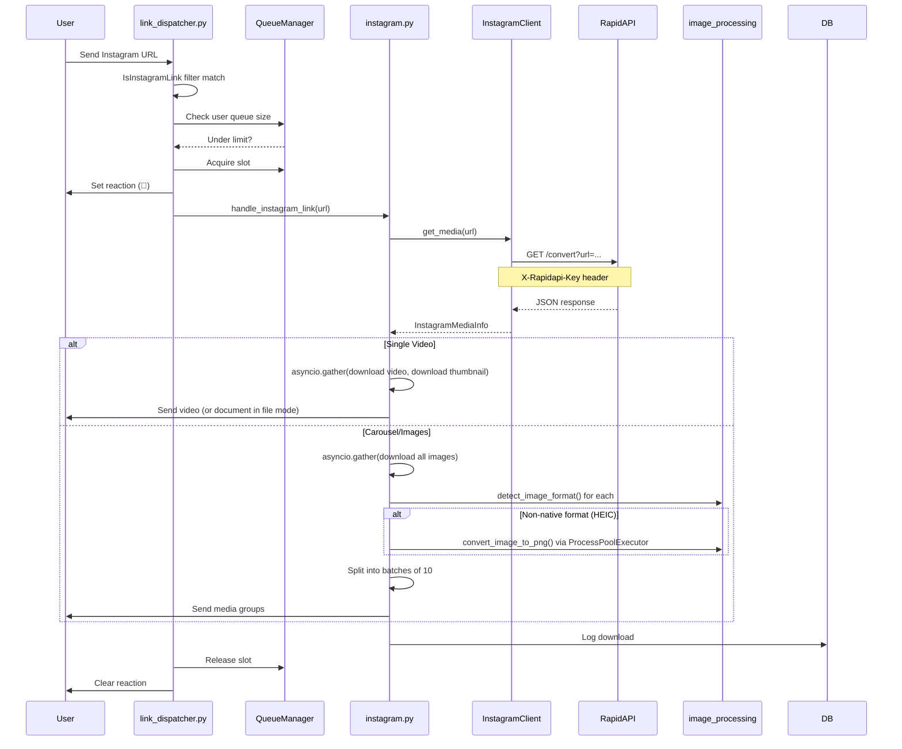
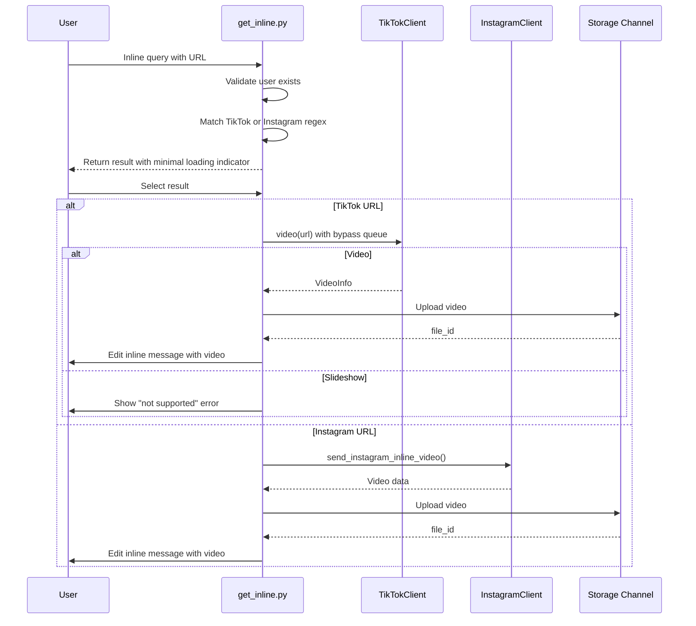

# Codebase Map

> Auto-generated by Cartographer. Last mapped: 2026-02-28

## System Overview

**tt-bot** is a production-grade Telegram bot for downloading TikTok and Instagram videos, slideshows, and audio without watermarks. Built with Python 3.13, aiogram 3.x, yt-dlp, and RapidAPI.

**Version:** 4.5.0
**Stack:** Python 3.13, aiogram 3.24, yt-dlp, curl_cffi, aiohttp, SQLAlchemy 2.0, asyncpg


```mermaid
graph TB
    subgraph Entry["Entry Points"]
        Main[main.py<br/>Main Bot]
        Stats[stats.py<br/>Stats Bot]
        Maint[maintenance_bot.py<br/>Maintenance Mode]
    end

    subgraph Handlers["Telegram Handlers"]
        LinkDisp[link_dispatcher.py<br/>URL Routing]
        IGHandler[instagram.py<br/>Instagram Downloads]
        Video[get_video.py<br/>TikTok Downloads]
        Music[get_music.py<br/>Audio Extraction]
        Inline[get_inline.py<br/>Inline Mode]
        User[user.py<br/>User Commands]
        Admin[admin.py<br/>Admin Commands]
        Lang[lang.py<br/>Language Selection]
        Advert[advert.py<br/>Broadcasts]
    end

    subgraph Instagram["Instagram API"]
        IGClient[client.py<br/>RapidAPI Client]
        IGModels[models.py<br/>InstagramMediaInfo]
        IGExc[exceptions.py<br/>Error Types]
    end

    subgraph TikTok["TikTok API"]
        Client[client.py<br/>Main Client + 3-Part Retry]
        Proxy[proxy_manager.py<br/>Proxy Rotation]
        Models[models.py<br/>VideoInfo/MusicInfo]
        Exc[exceptions.py<br/>Error Types]
    end

    subgraph Data["Data Layer"]
        Config[config.py<br/>Configuration]
        DB[database.py<br/>SQLAlchemy Engine]
        DBSvc[db_service.py<br/>Repository]
        DBModels[models/<br/>User/Video/Music]
    end

    subgraph MediaPkg["Media Types Package"]
        SendVid[send_video.py]
        SendImg[send_images.py]
        SendMus[send_music.py]
        HttpSes[http_session.py]
        ImgProc[image_processing.py]
        ErrMap[errors.py]
        Storage[storage.py]
        UI[ui.py]
    end

    subgraph Misc["Utilities"]
        Queue[queue_manager.py<br/>Concurrency Control]
        Utils[utils.py<br/>Helpers]
    end

    subgraph StatsM["Stats Module"]
        Router[router.py<br/>Stats Commands]
        Graphs[graphs.py<br/>Graph Generation]
        StMisc[misc.py<br/>Stats Calculation]
    end

    Main --> Handlers
    Stats --> StatsM
    LinkDisp --> IGHandler
    LinkDisp -.->|falls through| Video
    IGHandler --> Instagram
    IGHandler --> MediaPkg
    Video --> TikTok
    Handlers --> MediaPkg
    Handlers --> Misc
    Inline --> TikTok
    Inline --> Instagram
    TikTok --> Proxy
    IGClient --> HttpSes
    Handlers --> Data
    StatsM --> Data
    SendVid --> HttpSes
    SendVid --> Storage
    SendVid --> UI
    SendImg --> ImgProc
    SendImg --> UI
    SendMus --> HttpSes
    Storage --> HttpSes
    ErrMap --> TikTok
    ErrMap --> Instagram
```

## 3-Part Retry Strategy

The TikTok extraction uses a 3-part retry strategy with proxy rotation:


```mermaid
graph TB
    subgraph PS["ProxySession"]
        Init[Initialize proxy]
        Rotate[Rotate on retry]
    end

    subgraph P1["Part 1: URL Resolution"]
        Resolve[_resolve_url]
        Short[Short URLs → Full URLs]
    end

    subgraph P2["Part 2: Video Info"]
        Extract[_extract_video_info_with_retry]
        YtDlp[yt-dlp extraction]
    end

    subgraph P3["Part 3: Download"]
        Video[_download_video_with_retry]
        Slideshow[download_slideshow_images]
        Music[_download_music_with_retry]
    end

    PS --> P1
    P1 --> P2
    P2 --> P3

    P1 -.->|On failure| Rotate
    P2 -.->|On failure| Rotate
    P3 -.->|On failure| Rotate
```

**Key Design:**
- Same proxy used across all parts unless retry triggered
- Instant retry with proxy rotation (no delay)
- Individual image retry for slideshows (not whole batch)
- Permanent errors (deleted, private) not retried

## Chrome 120 Impersonation (Anti-WAF)

TikTok WAF blocks datacenter IPs and detects bot fingerprints. The solution:

```python
TIKTOK_IMPERSONATE_TARGET = "chrome120"  # Fixed to Chrome 120
TIKTOK_USER_AGENT = "Mozilla/5.0 ... Chrome/120.0.0.0 ..."  # Must match
```

**Implementation:**
- yt-dlp: `ImpersonateTarget("chrome", "120", "macos", None)`
- curl_cffi: `impersonate="chrome120"`
- Headers: User-Agent must match impersonation target

**Why Chrome 120?** Newer versions (136+) blocked when used with proxies due to fingerprint mismatches.

## Directory Structure

```
tt-bot/
├── main.py                 # Main bot entry point
├── stats.py                # Stats bot entry point
├── maintenance_bot.py      # Maintenance mode bot
├── tiktok_api/             # TikTok extraction module
│   ├── __init__.py         # Public exports
│   ├── client.py           # Main TikTokClient + ProxySession + 3-part retry (1960 lines)
│   ├── exceptions.py       # Exception hierarchy (9 error types)
│   ├── models.py           # VideoInfo, MusicInfo dataclasses
│   └── proxy_manager.py    # Round-robin proxy rotation
├── instagram_api/          # Instagram extraction module (RapidAPI)
│   ├── __init__.py         # Public exports + error mapping registration
│   ├── client.py           # InstagramClient + URL regex
│   ├── exceptions.py       # Exception hierarchy (4 error types)
│   └── models.py           # InstagramMediaItem, InstagramMediaInfo
├── handlers/               # Telegram message handlers
│   ├── link_dispatcher.py  # URL routing: Instagram vs TikTok
│   ├── instagram.py        # Instagram download handler
│   ├── get_video.py        # TikTok download handler + unsupported content handlers
│   ├── get_music.py        # Audio extraction handler
│   ├── get_inline.py       # Inline mode handler (TikTok + Instagram)
│   ├── user.py             # /start, /mode commands
│   ├── admin.py            # Admin commands
│   ├── advert.py           # Broadcast system
│   └── lang.py             # Language selection
├── data/                   # Data layer
│   ├── config.py           # Configuration + RetryConfig
│   ├── loader.py           # Bot/dispatcher initialization
│   ├── database.py         # SQLAlchemy engine/session
│   ├── db_service.py       # Database operations
│   ├── db_utils.py         # URL utilities
│   ├── locale/             # Language translations (8 languages)
│   └── models/             # SQLAlchemy models
│       ├── users.py        # Users table
│       ├── video.py        # Videos table
│       └── music.py        # Music table
├── media_types/            # Media sending/processing package
│   ├── __init__.py         # Re-exports public API
│   ├── http_session.py     # Shared aiohttp session, URL/thumbnail download
│   ├── storage.py          # Upload to Telegram storage channel (inline)
│   ├── errors.py           # Extensible error-to-message mapping
│   ├── image_processing.py # PIL/HEIF conversion, format detection
│   ├── ui.py               # Keyboard and caption helpers
│   ├── send_video.py       # Video sending logic
│   ├── send_music.py       # Music sending logic
│   └── send_images.py      # Image download and slideshow sending
├── misc/                   # Utilities
│   ├── queue_manager.py    # Per-user concurrency control
│   └── utils.py            # Helper functions
├── stats/                  # Statistics module
│   ├── loader.py           # Stats bot initialization
│   ├── router.py           # Stats commands
│   ├── graphs.py           # Matplotlib graphs
│   ├── misc.py             # Stats calculation
│   └── botstat.py          # BotSafe integration
├── docs/                   # Documentation
├── scripts/                # Shell scripts
├── Dockerfile              # Container build
├── docker-compose.yml      # Service orchestration
└── pyproject.toml          # Dependencies (uv)
```

## Module Guide

### TikTok API (`tiktok_api/`)

**Purpose:** TikTok video/audio extraction using yt-dlp with browser impersonation and 3-part retry strategy

| File | Purpose | Tokens |
|------|---------|--------|
| client.py | Main TikTokClient + ProxySession + 3-part retry | 16,110 |
| proxy_manager.py | Thread-safe round-robin proxy rotation | 1,303 |
| models.py | VideoInfo, MusicInfo dataclasses | 1,079 |
| exceptions.py | Exception hierarchy (9 error types) | 233 |

**Resource Pooling (Class-Level Shared Resources):**
```python
_executor: ThreadPoolExecutor (500 workers)      # For yt-dlp sync calls
_aiohttp_connector: TCPConnector                  # For URL resolution (no limit)
_curl_session_pool: dict[proxy, CurlAsyncSession] # Per-proxy curl sessions (1000 clients each)
```

**Key Classes:**
- `TikTokClient`: Main extraction client with integrated retry
- `ProxySession`: Manages proxy state per request flow (sticky until retry)
- `ProxyManager`: Proxy rotation manager (singleton)
- `VideoInfo`, `MusicInfo`: Response dataclasses with context manager support

**Key Methods (3-Part Retry):**
- `_resolve_url()`: Part 1 - Resolve short URLs with retry
- `_extract_video_info_with_retry()`: Part 2 - Extract metadata with retry
- `_download_video_with_retry()`: Part 3 - Download video with retry
- `_download_music_with_retry()`: Part 3 - Download music with retry
- `download_slideshow_images()`: Part 3 - Download images with individual retry
- `video()`: Orchestrates all 3 parts (retries built-in)
- `music()`: Orchestrates Parts 2 & 3 (retries built-in)

**Exceptions:**
- `TikTokError`: Base class
- `TikTokInvalidLinkError`: Part 1 failure (URL resolution)
- `TikTokDeletedError`, `TikTokPrivateError`: Permanent errors (not retried)
- `TikTokNetworkError`, `TikTokExtractionError`: Transient errors (retried)
- `TikTokRateLimitError`, `TikTokRegionError`, `TikTokVideoTooLongError`

**Patterns:**
- Singleton resources (ThreadPoolExecutor, curl session, aiohttp connector)
- Context manager for VideoInfo cleanup (RAII)
- ProxySession for sticky proxy with rotation on retry

---

### Instagram API (`instagram_api/`)

**Purpose:** Instagram media extraction via RapidAPI — no cookies, proxies, or browser impersonation needed

| File | Purpose | Tokens |
|------|---------|--------|
| client.py | InstagramClient HTTP client + URL regex | 499 |
| models.py | InstagramMediaItem, InstagramMediaInfo dataclasses | 254 |
| exceptions.py | Exception hierarchy (4 error types) | 70 |
| __init__.py | Public exports + self-registering error mappings | 153 |

**Key Classes:**
- `InstagramClient`: Stateless client, calls RapidAPI endpoint via shared aiohttp session
- `InstagramMediaInfo`: Response container with computed properties (`is_video`, `is_carousel`, `image_urls`, `video_url`, `thumbnail_url`)
- `InstagramMediaItem`: Individual media item (type, url, thumbnail, quality)

**Exceptions:**
- `InstagramError`: Base class
- `InstagramNetworkError`: Connection/HTTP failures
- `InstagramNotFoundError`: 404 or empty media
- `InstagramRateLimitError`: HTTP 429

**Self-Registering Error Mappings:**
Importing `instagram_api` automatically calls `register_error_mapping()` for:
- `InstagramNotFoundError` → `"error_instagram_not_found"`
- `InstagramNetworkError` → `"error_network"` (shared key with TikTok)
- `InstagramRateLimitError` → `"error_rate_limit"` (shared key with TikTok)

**URL Regex:** `r"https?://(?:www\.)?instagram\.com/(?:p|reels?|reel|tv|stories)/[\w-]+"`

**Config:** `config["instagram"]["rapidapi_key"]` from `RAPIDAPI_KEY` env var

---

### Handlers (`handlers/`)

**Purpose:** Telegram message/callback handlers using aiogram routers

| File | Purpose | Tokens |
|------|---------|--------|
| get_video.py | TikTok download + unsupported content handlers | 2,674 |
| instagram.py | Instagram video/carousel download handler | 1,935 |
| get_inline.py | Inline queries (TikTok + Instagram) | 1,731 |
| get_music.py | Audio extraction | 971 |
| advert.py | Admin broadcast system | 852 |
| link_dispatcher.py | URL routing: Instagram filter → TikTok fallthrough | 791 |
| lang.py | Language selection | 469 |
| user.py | /start, /mode commands | 384 |
| admin.py | Admin commands (/msg, /export, /botstat) | 253 |

**Router Order (critical — registered in `main.py`):**
```
user_router → lang_router → admin_router → advert_router
  → link_router (Instagram URLs intercepted here)
  → video_router (TikTok — only non-Instagram text reaches here)
  → music_router → inline_router
```

**Key Routes:**
- `link_router`: Custom `IsInstagramLink` filter intercepts Instagram URLs before TikTok handler
- `video_router`: Handles TikTok URLs in messages
- `music_router`: Handles music button callbacks
- `inline_router`: Handles inline queries and chosen results (TikTok + Instagram)
- `user_router`: /start, /mode
- `lang_router`: /lang and language callbacks
- `admin_router`: Admin-only commands
- `advert_router`: Broadcast management

**URL Dispatch Pattern (`link_dispatcher.py`):**
- `IsInstagramLink(Filter)`: regex match on message text → injects `instagram_url` as handler parameter
- Match → `handle_instagram_link()` (lazy import to avoid circular deps)
- No match → falls through to `video_router` (TikTok regex check)

**Unsupported Content Handlers (in `get_video.py`):**
- `handle_video_upload()`: Inform users to send links, not videos (F.video | F.video_note)
- `handle_image_upload()`: Inform users about links only (F.photo)
- `handle_voice_upload()`: Same for voice/audio (F.voice | F.audio)
- `handle_unsupported_content()`: Catch-all for unsupported content types

---

### Data Layer (`data/`)

**Purpose:** Configuration, database, and localization

| File | Purpose | Tokens |
|------|---------|--------|
| config.py | Load config + RetryConfig + InstagramConfig from env vars | 1,631 |
| db_service.py | Repository pattern database operations | 1,609 |
| database.py | SQLAlchemy async engine/session | 517 |
| loader.py | Bot/dispatcher/scheduler initialization | 293 |
| db_utils.py | Database URL utilities | 379 |

**Models:**
- `Users`: user_id, lang, file_mode, ad tracking
- `Video`: download history with timestamps
- `Music`: music download history

**Configuration Sections:**
- `bot`: Tokens, DB URL, Telegram server
- `api`: BotSafe, Monetag
- `logs`: Join logs, stats chat
- `queue`: Max queue size
- `retry`: URL/info/download retry counts
- `proxy`: Proxy file, rotation settings
- `performance`: Streaming threshold, max duration
- `instagram`: RapidAPI key

---

### Media Types (`media_types/`)

**Purpose:** Media sending and processing, split into focused modules for extensibility. Designed so new video sources (Instagram, YouTube Shorts, etc.) can plug in without modifying existing modules.

| File | Purpose | Tokens |
|------|---------|--------|
| send_images.py | TikTok slideshow download and sending with retry | 1,291 |
| image_processing.py | PIL/HEIF conversion, format detection, ProcessPoolExecutor | 505 |
| send_video.py | Video sending (regular + inline) with thumbnail | 607 |
| http_session.py | Shared aiohttp session, URL/thumbnail download | 353 |
| storage.py | Upload to Telegram storage channel (inline messages) | 418 |
| errors.py | Extensible error-to-message mapping (TikTok + Instagram) | 261 |
| send_music.py | Music sending with cover art | 257 |
| ui.py | Keyboard and caption helpers | 139 |
| __init__.py | Re-exports public API (flat import surface) | 123 |

**Dependency Graph (no cycles):**
```
http_session     (standalone)
image_processing (standalone — stdlib + optional PIL)
ui               (standalone)
errors           (standalone — imports tiktok_api exceptions)
storage          → http_session
send_music       → http_session
send_video       → http_session, storage, ui
send_images      → image_processing, ui
```

**Extensibility Pattern:**
- `errors.py`: New sources register their errors via `register_error_mapping(ExceptionType, "locale_key")` at import time
- `storage.py`: Uses `video_info.link` (not hardcoded URLs) — works for any source
- Send functions: Operate on `VideoInfo`/`MusicInfo` abstractions — source-agnostic
- `send_images.py`: Currently TikTok-coupled (uses `TikTokClient`, `_proxy_session`) — will be refactored when a second image source is added

**Key Functions:**
- `send_video_result()`: Send video with thumbnail and music button (or edit inline message)
- `send_image_result()`: Send slideshow in batches of 10 with HEIC→JPEG conversion
- `send_music_result()`: Send audio with cover art
- `get_error_message()`: Map any registered exception to localized message
- `close_http_session()`: Shutdown cleanup (called from `main.py`)

---

### Utilities (`misc/`)

**Purpose:** Shared utilities for queue management and helpers

| File | Purpose | Tokens |
|------|---------|--------|
| queue_manager.py | Per-user concurrency limits (singleton) | ~1,029 |
| utils.py | Language resolution, user registration, admin filters | ~692 |

**Key Functions:**
- `QueueManager.info_queue()`: Acquire/release queue slot
- `lang_func()`: Resolve user language from DB
- `start_manager()`: New user onboarding
- `IsAdmin`, `IsSecondAdmin`, `IsStatsAdmin`: aiogram filter classes

---

### Stats Module (`stats/`)

**Purpose:** Real-time statistics and graph generation

| File | Purpose | Tokens |
|------|---------|--------|
| router.py | Interactive stats menu commands | 3,413 |
| graphs.py | Matplotlib time series graphs | 1,347 |
| misc.py | Stats calculation, scheduled updates | 1,006 |
| loader.py | Stats bot initialization | 276 |
| botstat.py | BotSafe API integration | 365 |

**Features:**
- Quick stats (overall + daily)
- Time series graphs (users, videos, music)
- User search
- Referral tracking
- Scheduled message updates (hourly overall, 5-min daily)

---

## Data Flow

### Video Download Flow (with 3-Part Retry)


```mermaid
sequenceDiagram
    participant User
    participant Handler as get_video.py
    participant Queue as QueueManager
    participant Client as TikTokClient
    participant PS as ProxySession
    participant yt-dlp
    participant TikTok
    participant DB

    User->>Handler: Send TikTok URL
    Handler->>Handler: Validate URL regex
    Handler->>Queue: Check user queue size
    Queue-->>Handler: Under limit?
    Handler->>Queue: Acquire slot
    Handler->>User: Set reaction (👀)
    Handler->>Client: video(url)

    Client->>PS: Create ProxySession
    PS-->>Client: Initial proxy

    rect rgb(200, 220, 255)
        Note over Client,TikTok: Part 1: URL Resolution
        Client->>TikTok: Resolve short URL
        alt Success
            TikTok-->>Client: Full URL
        else Failure
            Client->>PS: Rotate proxy
            Client->>TikTok: Retry resolve
        end
    end

    rect rgb(200, 255, 220)
        Note over Client,TikTok: Part 2: Video Info
        Client->>yt-dlp: Extract video info
        yt-dlp->>TikTok: Fetch page/API
        alt Success
            TikTok-->>yt-dlp: Video metadata
            yt-dlp-->>Client: VideoInfo
        else Transient Error
            Client->>PS: Rotate proxy
            Client->>yt-dlp: Retry extraction
        end
    end

    rect rgb(255, 220, 200)
        Note over Client,TikTok: Part 3: Download
        alt Video
            Client->>TikTok: Download video bytes
            TikTok-->>Client: Video data
            Client-->>Handler: VideoInfo (bytes)
            Handler->>User: Send video + music button
        else Slideshow
            Client-->>Handler: VideoInfo (image URLs + ProxySession)
            Handler->>TikTok: Download images (parallel with individual retry)
            Handler->>Handler: Convert HEIC if needed
            Handler->>User: Send image batches
        end
    end

    Handler->>DB: Log download
    Handler->>Queue: Release slot
    Handler->>User: Clear reaction
```

### Music Extraction Flow (with 2-Part Retry)


```mermaid
sequenceDiagram
    participant User
    participant Handler as get_music.py
    participant Client as TikTokClient
    participant PS as ProxySession
    participant TikTok
    participant DB

    User->>Handler: Click music button
    Handler->>Handler: Remove button (prevent double-click)
    Handler->>User: Set reaction (👀)
    Handler->>Client: music(video_id)

    Client->>PS: Create ProxySession

    rect rgb(200, 255, 220)
        Note over Client,TikTok: Part 2: Music Info
        Client->>TikTok: Extract audio URL
        alt Failure
            Client->>PS: Rotate proxy
            Client->>TikTok: Retry extraction
        end
    end

    rect rgb(255, 220, 200)
        Note over Client,TikTok: Part 3: Download
        Client->>TikTok: Download audio + cover
        alt Failure
            Client->>PS: Rotate proxy
            Client->>TikTok: Retry download
        end
        TikTok-->>Client: MusicInfo
    end

    Client-->>Handler: MusicInfo
    Handler->>User: Send audio file
    Handler->>DB: Log music download
```

### Instagram Download Flow


```mermaid
sequenceDiagram
    participant User
    participant LinkDisp as link_dispatcher.py
    participant Queue as QueueManager
    participant Handler as instagram.py
    participant Client as InstagramClient
    participant RapidAPI
    participant ImgProc as image_processing
    participant DB

    User->>LinkDisp: Send Instagram URL
    LinkDisp->>LinkDisp: IsInstagramLink filter match
    LinkDisp->>Queue: Check user queue size
    Queue-->>LinkDisp: Under limit?
    LinkDisp->>Queue: Acquire slot
    LinkDisp->>User: Set reaction (👀)
    LinkDisp->>Handler: handle_instagram_link(url)

    Handler->>Client: get_media(url)
    Client->>RapidAPI: GET /convert?url=...
    Note over Client,RapidAPI: X-Rapidapi-Key header
    RapidAPI-->>Client: JSON response
    Client-->>Handler: InstagramMediaInfo

    alt Single Video
        Handler->>Handler: asyncio.gather(download video, download thumbnail)
        Handler->>User: Send video (or document in file mode)
    else Carousel/Images
        Handler->>Handler: asyncio.gather(download all images)
        Handler->>ImgProc: detect_image_format() for each
        alt Non-native format (HEIC)
            Handler->>ImgProc: convert_image_to_png() via ProcessPoolExecutor
        end
        Handler->>Handler: Split into batches of 10
        Handler->>User: Send media groups
    end

    Handler->>DB: Log download
    LinkDisp->>Queue: Release slot
    LinkDisp->>User: Clear reaction
```

### Inline Mode Flow (TikTok + Instagram)


```mermaid
sequenceDiagram
    participant User
    participant Inline as get_inline.py
    participant Client as TikTokClient
    participant IGClient as InstagramClient
    participant Storage as Storage Channel

    User->>Inline: Inline query with URL
    Inline->>Inline: Validate user exists
    Inline->>Inline: Match TikTok or Instagram regex
    Inline-->>User: Return result with minimal loading indicator
    User->>Inline: Select result

    alt TikTok URL
        Inline->>Client: video(url) with bypass queue
        alt Video
            Client-->>Inline: VideoInfo
            Inline->>Storage: Upload video
            Storage-->>Inline: file_id
            Inline->>User: Edit inline message with video
        else Slideshow
            Inline->>User: Show "not supported" error
        end
    else Instagram URL
        Inline->>IGClient: send_instagram_inline_video()
        IGClient-->>Inline: Video data
        Inline->>Storage: Upload video
        Storage-->>Inline: file_id
        Inline->>User: Edit inline message with video
    end
```

## Conventions

### Code Style
- **Python 3.13** with strict version pinning
- **Async/await** throughout (aiogram, asyncpg, aiohttp)
- **Type hints** on function signatures
- **Dataclasses** for structured data (VideoInfo, MusicInfo, ProxySession)

### Error Handling
- Custom exception hierarchies (`TikTokError`, `InstagramError`)
- Extensible error registry: `register_error_mapping()` for any source
- TikTok: 3-part retry with proxy rotation (instant retry)
- Instagram: single-shot via RapidAPI (no retry)
- Emoji reactions for status updates (👀 → result or 😢)
- Localized error messages (private chats only, groups fail silently)

### Resource Management
- RAII pattern with context managers
- Singleton shared resources (executor, sessions)
- Explicit cleanup on shutdown
- ProxySession per request flow

### Configuration
- Environment variables via python-dotenv
- JSON arrays for lists (`ADMIN_IDS=[123,456]`)
- Sensible defaults in config.py

## Gotchas

### TikTok API
- **yt-dlp private API**: Uses `_extract_web_data_and_status()` which may break on updates
- **VideoInfo cleanup**: Slideshows MUST call `.close()` to release yt-dlp resources
- **Chrome 120 fixed**: Newer versions (136+) blocked with proxies due to fingerprint mismatch
- **TikTok status codes**: 10204=deleted, 10222=private, 10216=under review

### 3-Part Retry Strategy
- **ProxySession sticky**: Same proxy across all parts unless retry
- **Instant retry**: No delay on retry (proxy rotation = different IP)
- **Part 1 only for short URLs**: Full URLs skip Part 1
- **Permanent errors not retried**: Deleted, private, region errors fail immediately
- **Slideshow individual retry**: Failed images retry independently (not whole batch)

### Queue Management
- **Pre-check required**: Check queue size BEFORE acquiring slot
- **Inline bypass**: Inline downloads use `bypass_user_limit=True`

### Image Processing
- **Persistent ProcessPoolExecutor**: Avoids shutdown errors under high load (4 workers)
- **HEIF registration**: Opener registered once at module load
- **Group limit**: Only first 10 images sent in groups

### Database
- **Initialization order**: Must call `initialize_database_components()` before any DB ops
- **URL rewriting**: PostgreSQL URLs auto-converted to `postgresql+asyncpg://`

### Instagram API
- **RapidAPI dependency**: All Instagram downloads go through a third-party RapidAPI endpoint — subject to rate limits and availability
- **No retry**: Unlike TikTok, Instagram requests are not retried on failure
- **Empty RAPIDAPI_KEY**: If env var is unset, all Instagram API calls will fail with 401/403
- **URL regex coverage**: Matches `/p/`, `/reels/`, `/reel/`, `/tv/`, `/stories/` paths
- **Inline video only**: Instagram inline mode only supports single videos (no carousels)

### Inline Mode
- **Storage channel required**: Must set `STORAGE_CHANNEL_ID`
- **No slideshows**: Inline mode only supports videos (both TikTok and Instagram)
- **Minimal loading indicator**: Button with "⏳" text and "loading" callback_data
- **Instagram prefix**: Instagram inline results use `"ig_download/"` prefix to distinguish from TikTok

## Navigation Guide

| Task | Files to Modify |
|------|----------------|
| Add new command | `handlers/*.py` → Register in `main.py` |
| Modify TikTok extraction | `tiktok_api/client.py` |
| Change retry logic | `tiktok_api/client.py` (ProxySession, _*_with_retry methods) |
| Change browser impersonation | `tiktok_api/client.py` (TIKTOK_IMPERSONATE_TARGET, TIKTOK_USER_AGENT) |
| Change database schema | `data/models/*.py` (auto-creates tables) |
| Add language | Create `data/locale/XX.json` (auto-detected) |
| Tune performance | Set env vars or edit `data/config.py` defaults |
| Add error type | `tiktok_api/exceptions.py` → Register in `media_types/errors.py` via `register_error_mapping()` |
| Change queue limits | `MAX_USER_QUEUE_SIZE` env var |
| Add stats graph | `stats/router.py` + `stats/graphs.py` |
| Modify video sending | `media_types/send_video.py:send_video_result()` |
| Modify slideshow sending | `media_types/send_images.py:send_image_result()` |
| Modify Instagram extraction | `instagram_api/client.py` |
| Modify Instagram sending | `handlers/instagram.py` |
| Add new URL source | Create `source_api/` module → register errors in `__init__.py` → add filter in `handlers/link_dispatcher.py` → create handler |
| Add unsupported content handler | `handlers/get_video.py` |
| Add new video source | Create source API module, call `register_error_mapping()` in `__init__.py`, add URL filter in `link_dispatcher.py`, create handler |

## Environment Variables

### Required
| Variable | Description |
|----------|-------------|
| `BOT_TOKEN` | Main bot token |
| `DB_URL` | PostgreSQL connection string |
| `TG_SERVER` | Telegram API server URL |
| `TELEGRAM_API_ID` | Telegram API ID (for custom Bot API server) |
| `TELEGRAM_API_HASH` | Telegram API hash (for custom Bot API server) |
| `RAPIDAPI_KEY` | RapidAPI key for Instagram downloader endpoint |

### Retry Configuration
| Variable | Default | Description |
|----------|---------|-------------|
| `URL_RESOLVE_MAX_RETRIES` | 3 | Part 1: URL resolution retries |
| `VIDEO_INFO_MAX_RETRIES` | 3 | Part 2: Video info extraction retries |
| `DOWNLOAD_MAX_RETRIES` | 3 | Part 3: Download retries |

### Performance
| Variable | Default | Description |
|----------|---------|-------------|
| `MAX_USER_QUEUE_SIZE` | 0 | Max concurrent per user (0=unlimited) |
| `MAX_VIDEO_DURATION` | 0 | Max video duration (seconds, 0=unlimited) |
| `STREAMING_DURATION_THRESHOLD` | 300 | Stream videos longer than this (seconds) |
| `LOG_LEVEL` | INFO | Logging level |

**Note:** Thread pool (500 workers) and curl_cffi connections (1000 per proxy) are hardcoded for maximum throughput.

See `.env.example` for complete list.

## Recent Changes (Since 2025-01-15)

1. **Instagram download support** - New `instagram_api/` module with RapidAPI client, `handlers/instagram.py` for video/carousel downloads, `handlers/link_dispatcher.py` for URL routing, inline mode Instagram support
2. **media_types/ package split** - Monolithic `misc/video_types.py` split into 8 focused modules with extensible error mapping via `register_error_mapping()`
3. **Chrome 120 Impersonation** - Fixed to Chrome 120 to bypass TikTok WAF blocking
4. **Unsupported Content Handlers** - New handlers for videos, images, voice messages in private chats
5. **Minimal Loading Indicator** - Inline queries show "⏳" button instead of "Please wait" text
6. **Performance Hardcoding** - Removed performance config, hardcoded maximum throughput values
7. **Proxy Rotation Fixes** - Improved proxy handling for TikTok extraction
8. **Separate stats Docker image** - Stats bot runs in its own container
