# Codebase Map

> Auto-generated by Cartographer. Last mapped: 2026-01-15

## System Overview

**tt-bot** is a production-grade Telegram bot for downloading TikTok videos, slideshows, and audio without watermarks. Built with Python 3.13, aiogram 3.x, and yt-dlp.

**Version:** 4.5.0
**Stack:** Python 3.13, aiogram 3.24, yt-dlp, curl_cffi, SQLAlchemy 2.0, asyncpg, aiohttp


## 3-Part Retry Strategy

The TikTok extraction uses a 3-part retry strategy with proxy rotation:

```mermaid
graph TB
    subgraph PS["ProxySession"]
        Init[Initialize proxy]
        Rotate[Rotate on retry]
    end

    subgraph P1["Part 1: URL Resolution"]
        Resolve[_resolve_url]
        Short[Short URLs → Full URLs]
    end

    subgraph P2["Part 2: Video Info"]
        Extract[_extract_video_info_with_retry]
        YtDlp[yt-dlp extraction]
    end

    subgraph P3["Part 3: Download"]
        Video[_download_video_with_retry]
        Slideshow[download_slideshow_images]
        Music[_download_music_with_retry]
    end

    PS --> P1
    P1 --> P2
    P2 --> P3

    P1 -.->|On failure| Rotate
    P2 -.->|On failure| Rotate
    P3 -.->|On failure| Rotate
```



**Key Design:**
- Same proxy used across all parts unless retry triggered
- Instant retry with proxy rotation (no delay)
- Individual image retry for slideshows (not whole batch)
- Permanent errors (deleted, private) not retried

## Directory Structure

```
tt-bot/
├── main.py                 # Main bot entry point
├── stats.py                # Stats bot entry point
├── maintenance_bot.py      # Maintenance mode bot
├── tiktok_api/             # TikTok extraction module
│   ├── __init__.py         # Public exports
│   ├── client.py           # Main TikTokClient + ProxySession + 3-part retry
│   ├── exceptions.py       # Exception hierarchy (9 error types)
│   ├── models.py           # VideoInfo, MusicInfo dataclasses
│   └── proxy_manager.py    # Round-robin proxy rotation
├── handlers/               # Telegram message handlers
│   ├── get_video.py        # Video/slideshow download handler
│   ├── get_music.py        # Audio extraction handler
│   ├── get_inline.py       # Inline mode handler
│   ├── user.py             # /start, /mode commands
│   ├── admin.py            # Admin commands
│   ├── advert.py           # Broadcast system
│   └── lang.py             # Language selection
├── data/                   # Data layer
│   ├── config.py           # Configuration + RetryConfig
│   ├── loader.py           # Bot/dispatcher initialization
│   ├── database.py         # SQLAlchemy engine/session
│   ├── db_service.py       # Database operations
│   ├── db_utils.py         # URL utilities
│   ├── locale/             # Language translations (8 languages)
│   └── models/             # SQLAlchemy models
│       ├── users.py        # Users table
│       ├── video.py        # Videos table
│       └── music.py        # Music table
├── misc/                   # Utilities
│   ├── queue_manager.py    # Per-user concurrency control
│   ├── video_types.py      # Media sending/processing + slideshow retry
│   └── utils.py            # Helper functions
├── stats/                  # Statistics module
│   ├── loader.py           # Stats bot initialization
│   ├── router.py           # Stats commands
│   ├── graphs.py           # Matplotlib graphs
│   ├── misc.py             # Stats calculation
│   └── botstat.py          # BotSafe integration
├── docs/                   # Documentation
├── scripts/                # Shell scripts
├── Dockerfile              # Container build
├── docker-compose.yml      # Service orchestration
└── pyproject.toml          # Dependencies (uv)
```

## Module Guide

### TikTok API (`tiktok_api/`)

**Purpose:** TikTok video/audio extraction using yt-dlp with browser impersonation and 3-part retry strategy

| File | Purpose | Tokens |
|------|---------|--------|
| client.py | Main TikTokClient + ProxySession + 3-part retry | 16,499 |
| proxy_manager.py | Thread-safe round-robin proxy rotation | 1,303 |
| models.py | VideoInfo, MusicInfo dataclasses | 1,079 |
| exceptions.py | Exception hierarchy (9 error types) | 233 |

**Note:** `VideoInfo.author` field was removed (unused in codebase).

**Key Classes:**
- `TikTokClient`: Main extraction client with integrated retry
- `ProxySession`: Manages proxy state per request flow (sticky until retry)
- `ProxyManager`: Proxy rotation manager
- `VideoInfo`, `MusicInfo`: Response dataclasses

**Key Methods (3-Part Retry):**
- `_resolve_url()`: Part 1 - Resolve short URLs with retry
- `_extract_video_info_with_retry()`: Part 2 - Extract metadata with retry
- `_download_video_with_retry()`: Part 3 - Download video with retry
- `_download_music_with_retry()`: Part 3 - Download music with retry
- `download_slideshow_images()`: Part 3 - Download images with individual retry
- `video()`: Orchestrates all 3 parts (retries built-in)
- `music()`: Orchestrates Parts 2 & 3 (retries built-in)

**Exceptions:**
- `TikTokError`: Base class
- `TikTokInvalidLinkError`: Part 1 failure (URL resolution)
- `TikTokDeletedError`, `TikTokPrivateError`: Permanent errors (not retried)
- `TikTokNetworkError`, `TikTokExtractionError`: Transient errors (retried)
- `TikTokRateLimitError`, `TikTokRegionError`, `TikTokVideoTooLongError`

**Patterns:**
- Singleton resources (ThreadPoolExecutor, curl session, aiohttp connector)
- Context manager for VideoInfo cleanup (RAII)
- ProxySession for sticky proxy with rotation on retry

---

### Handlers (`handlers/`)

**Purpose:** Telegram message/callback handlers using aiogram routers

| File | Purpose | Tokens |
|------|---------|--------|
| get_video.py | Video/slideshow download (calls `video()` directly) | 2,174 |
| get_inline.py | Inline query handling (calls `video()` directly) | 1,347 |
| get_music.py | Audio extraction (calls `music()` directly) | 1,007 |
| advert.py | Admin broadcast system | 852 |
| lang.py | Language selection | 469 |
| user.py | /start, /mode commands | 384 |
| admin.py | Admin commands (/msg, /export, /botstat) | 348 |

**Key Routes:**
- `video_router`: Handles TikTok URLs in messages
- `music_router`: Handles music button callbacks
- `inline_router`: Handles inline queries and chosen results
- `user_router`: /start, /mode
- `lang_router`: /lang and language callbacks
- `admin_router`: Admin-only commands
- `advert_router`: Broadcast management

**Note:** Handlers now call `video()` and `music()` directly - retry logic is built-in.

---

### Data Layer (`data/`)

**Purpose:** Configuration, database, and localization

| File | Purpose | Tokens |
|------|---------|--------|
| config.py | Load config + RetryConfig from env vars | 1,765 |
| db_service.py | Repository pattern database operations | 1,609 |
| database.py | SQLAlchemy async engine/session | 517 |
| loader.py | Bot/dispatcher/scheduler initialization | 293 |
| db_utils.py | Database URL utilities | 379 |

**Models:**
- `Users`: user_id, lang, file_mode, ad tracking
- `Video`: download history with timestamps
- `Music`: music download history

**Configuration Sections:**
- `bot`: Tokens, DB URL, Telegram server
- `api`: BotSafe, Monetag
- `logs`: Join logs, stats chat
- `queue`: Max queue size
- `retry`: URL/info/download retry counts (NEW)
- `proxy`: Proxy file, rotation settings
- `performance`: Pool sizes, timeouts

---

### Utilities (`misc/`)

**Purpose:** Shared utilities for queue management and media processing

| File | Purpose | Tokens |
|------|---------|--------|
| video_types.py | Video/image sending, slideshow retry, HEIC conversion | 6,322 |
| queue_manager.py | Per-user concurrency limits | 1,029 |
| utils.py | Helpers (lang resolution, user registration) | 692 |

**Key Functions:**
- `send_video_result()`: Send video with thumbnail and music button
- `send_image_result()`: Send slideshow with Part 3 retry via `download_slideshow_images()`
- `send_music_result()`: Send audio with cover
- `QueueManager.info_queue()`: Acquire/release queue slot

**Note:** Thumbnail download thresholds:
- Inline messages: >30s (lowered from 60s)
- Regular messages: >60s

---

### Stats Module (`stats/`)

**Purpose:** Real-time statistics and graph generation

| File | Purpose | Tokens |
|------|---------|--------|
| router.py | Interactive stats menu commands | 3,413 |
| graphs.py | Matplotlib time series graphs | 1,347 |
| misc.py | Stats calculation, scheduled updates | 1,006 |
| loader.py | Stats bot initialization | 276 |
| botstat.py | BotSafe API integration | 365 |

**Features:**
- Quick stats (overall + daily)
- Time series graphs (users, videos, music)
- User search
- Referral tracking
- Scheduled message updates (hourly overall, 5-min daily)

---

## Data Flow

### Video Download Flow (with 3-Part Retry)


### Music Extraction Flow (with 2-Part Retry)


### Inline Mode Flow


## Conventions

### Code Style
- **Python 3.13** with strict version pinning
- **Async/await** throughout (aiogram, asyncpg, aiohttp)
- **Type hints** on function signatures
- **Dataclasses** for structured data (VideoInfo, MusicInfo, ProxySession)

### Error Handling
- Custom exception hierarchy (`TikTokError` base)
- 3-part retry with proxy rotation (instant retry)
- Permanent errors (deleted, private) not retried
- Emoji reactions for status updates (👀 → 👨‍💻 → result)
- Localized error messages

### Resource Management
- RAII pattern with context managers
- Singleton shared resources (executor, sessions)
- Explicit cleanup on shutdown
- ProxySession per request flow

### Configuration
- Environment variables via python-dotenv
- JSON arrays for lists (`ADMIN_IDS=[123,456]`)
- Sensible defaults in config.py

## Gotchas

### TikTok API
- **yt-dlp private API**: Uses `_extract_web_data_and_status()` which may break on updates
- **VideoInfo cleanup**: Slideshows MUST call `.close()` to release yt-dlp resources
- **Browser impersonation**: Auto-updates from yt-dlp BROWSER_TARGETS
- **Executor initialization**: Must call `TikTokClient.set_executor_size()` before first use
- **TikTok status codes**: 10204=deleted, 10222=private, 10216=under review

### 3-Part Retry Strategy
- **ProxySession sticky**: Same proxy across all parts unless retry
- **Instant retry**: No delay on retry (proxy rotation = different IP)
- **Part 1 only for short URLs**: Full URLs skip Part 1
- **Permanent errors not retried**: Deleted, private, region errors fail immediately
- **Slideshow individual retry**: Failed images retry independently (not whole batch)

### Queue Management
- **Pre-check required**: Check queue size BEFORE acquiring slot
- **Inline bypass**: Inline downloads use `bypass_user_limit=True`

### Image Processing
- **Persistent ProcessPoolExecutor**: Avoids shutdown errors under high load
- **HEIF registration**: Opener registered once at module load
- **Group limit**: Only first 10 images sent in groups

### Database
- **Initialization order**: Must call `initialize_database_components()` before any DB ops
- **URL rewriting**: PostgreSQL URLs auto-converted to `postgresql+asyncpg://`

### Inline Mode
- **Storage channel required**: Must set `STORAGE_CHANNEL_ID`
- **No slideshows**: Inline mode only supports videos

## Navigation Guide

| Task | Files to Modify |
|------|----------------|
| Add new command | `handlers/*.py` → Register in `main.py` |
| Modify TikTok extraction | `tiktok_api/client.py` |
| Change retry logic | `tiktok_api/client.py` (ProxySession, _*_with_retry methods) |
| Change database schema | `data/models/*.py` (auto-creates tables) |
| Add language | Create `data/locale/XX.json` (auto-detected) |
| Tune performance | Set env vars or edit `data/config.py` defaults |
| Add error type | `tiktok_api/exceptions.py` → Handle in `misc/video_types.py:get_error_message()` |
| Change queue limits | `MAX_USER_QUEUE_SIZE` env var |
| Add stats graph | `stats/router.py` + `stats/graphs.py` |
| Modify video sending | `misc/video_types.py:send_video_result()` |
| Modify slideshow sending | `misc/video_types.py:send_image_result()` |

## Environment Variables

### Required
| Variable | Description |
|----------|-------------|
| `BOT_TOKEN` | Main bot token |
| `DB_URL` | PostgreSQL connection string |
| `TG_SERVER` | Telegram API server URL |
| `TELEGRAM_API_ID` | Telegram API ID (for custom Bot API server) |
| `TELEGRAM_API_HASH` | Telegram API hash (for custom Bot API server) |

### Retry Configuration (NEW)
| Variable | Default | Description |
|----------|---------|-------------|
| `URL_RESOLVE_MAX_RETRIES` | 3 | Part 1: URL resolution retries |
| `VIDEO_INFO_MAX_RETRIES` | 3 | Part 2: Video info extraction retries |
| `DOWNLOAD_MAX_RETRIES` | 3 | Part 3: Download retries |

### Performance
| Variable | Default | Description |
|----------|---------|-------------|
| `MAX_USER_QUEUE_SIZE` | 0 | Max concurrent per user (0=unlimited) |
| `MAX_VIDEO_DURATION` | 0 | Max video duration (seconds, 0=unlimited) |
| `STREAMING_DURATION_THRESHOLD` | 300 | Stream videos longer than this (seconds) |
| `LOG_LEVEL` | INFO | Logging level |

**Note:** Thread pool (500 workers) and curl_cffi connections (10,000) are hardcoded for maximum throughput.

See `.env.example` for complete list.
